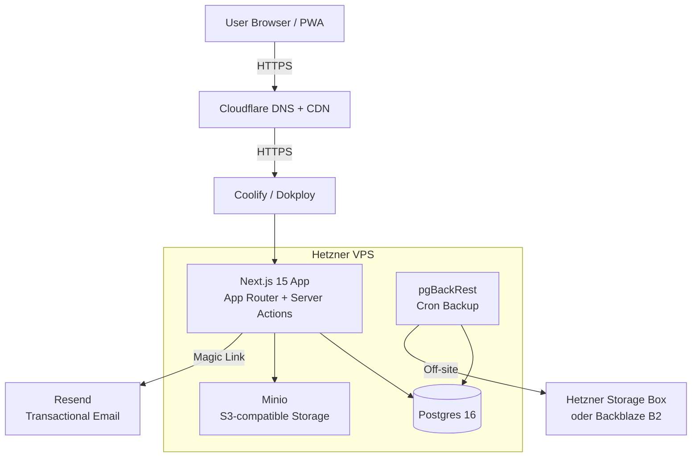

# RecipeScheduler — Product Requirements Document (PRD)

Technische Spezifikation für die Implementierung mit Claude Code.
Dieses Dokument baut auf `product-vision.md` auf und ist so geschrieben, dass jede Sektion direkt implementierbar ist.

---

## 1. Overview

- **Product Name:** RecipeScheduler
- **One-Liner:** Self-hosted Rezept-Bibliothek mit Wochenplaner und automatischer Einkaufsliste für Haushalte
- **Primary Objective:** Den Sonntag-Abend-Flow (Rezepte wählen → Einkaufsliste) auf unter 5 Minuten verkürzen und Mittwoch-Abend die Frage "Was kochen wir?" in 10 Sekunden beantworten
- **Differentiation:** Self-hosted, deutschsprachig, Household-Model, keine SaaS-Abhängigkeiten
- **Magic Moment:** Sonntag 20 Uhr → 5 Rezepte picken → fertige, gruppierte Einkaufsliste auf dem Handy
- **Success Criteria MVP:** 4 Wochen in Folge produktiv genutzt, ≥20 Rezepte erfasst, ≥80% der geplanten Wochen haben Einkaufsliste

---

## 2. Technical Architecture

### Architecture Overview



### Stack

| Layer | Tool | Version/Notes |
|---|---|---|
| Frontend Framework | Next.js | 15.x, App Router |
| UI Library | React | 19 (kommt mit Next 15) |
| Language | TypeScript | strict mode on |
| Styling | Tailwind CSS | v4 oder v3.4+ |
| Component Library | shadcn/ui | Latest |
| Icons | Lucide React | via shadcn |
| Backend | Next.js Server Actions + API Routes | integriert |
| ORM | Drizzle ORM | Latest |
| Database | PostgreSQL | 16.x |
| Auth | better-auth | Magic Link Plugin |
| File Storage | Minio | S3-compatible |
| Email | Resend SDK | for Magic Links |
| PWA | Statisches Web-App-Manifest | Add-to-Home-Screen, Standalone-Display (kein Service Worker im MVP) |
| Form Validation | Zod | für Server Actions + Client |
| Data Fetching | React Server Components + TanStack Query | für interaktive Bereiche |
| URL Recipe Parsing | `schema-dts` + eigener JSON-LD-Parser | kein externes SaaS |
| Testing | Vitest + Playwright | Unit + E2E |
| Deployment | Coolify oder Dokploy auf Hetzner CX22 | Docker-basiert |
| DNS / CDN | Cloudflare | optional aber empfohlen |

### Integration Notes

- **better-auth**: Nutze das `magicLink` Plugin, konfiguriere SMTP/Resend als Transport. Session-Cookies, sichere HTTP-Only Flags.
- **Drizzle**: Schema in `src/db/schema.ts`, Migrations via `drizzle-kit`. Nutze `pgTable`, relationale Abfragen mit `relations()`.
- **Minio**: S3-kompatible Client-Lib (`@aws-sdk/client-s3`) mit Minio-Endpoint. Signed URLs für direkten Browser-Upload (um Next.js-Server zu entlasten).
- **PWA-Manifest**: `public/manifest.json` + Icons, verlinkt via `<link rel="manifest">` in root layout. Kein Service Worker im MVP — nur Installierbarkeit (Home-Screen, Standalone-Display). Offline-Support via Service Worker ist bewusst aus-gescoped (siehe Roadmap Ideas Backlog).

### Repo Structure

```
recipe-scheduler/
├── docs/                           # diese Dokumente
├── public/
│   ├── icons/                      # PWA Icons (192, 512, maskable)
│   └── manifest.json
├── src/
│   ├── app/                        # Next.js App Router
│   │   ├── (auth)/                 # Auth-Flows (login, verify)
│   │   │   └── login/page.tsx
│   │   ├── (app)/                  # authentifizierte App
│   │   │   ├── layout.tsx          # Sidebar, Nav
│   │   │   ├── recipes/
│   │   │   │   ├── page.tsx        # Library
│   │   │   │   ├── new/page.tsx    # Rezept anlegen
│   │   │   │   └── [id]/
│   │   │   │       ├── page.tsx    # Detail
│   │   │   │       └── edit/page.tsx
│   │   │   ├── week/
│   │   │   │   └── page.tsx        # Wochenplan
│   │   │   ├── shopping/
│   │   │   │   └── page.tsx        # Einkaufsliste
│   │   │   └── settings/
│   │   │       └── page.tsx        # Household, Account
│   │   ├── api/
│   │   │   ├── auth/[...all]/route.ts    # better-auth
│   │   │   ├── recipes/import/route.ts   # URL-Import
│   │   │   └── upload/route.ts           # Minio Signed URL
│   │   └── layout.tsx
│   ├── components/
│   │   ├── ui/                     # shadcn primitives
│   │   ├── recipe/                 # Rezept-Komponenten
│   │   ├── week/                   # Wochenplan-Komponenten
│   │   ├── shopping/               # Shopping-List
│   │   └── layout/                 # Nav, Sidebar
│   ├── db/
│   │   ├── schema.ts               # Drizzle Schema
│   │   ├── index.ts                # DB Client
│   │   └── migrations/             # drizzle-kit output
│   ├── lib/
│   │   ├── auth.ts                 # better-auth setup
│   │   ├── storage.ts              # Minio client
│   │   ├── recipe-parser.ts        # JSON-LD parser
│   │   ├── shopping-list.ts        # Aggregations-Logik
│   │   └── utils.ts
│   ├── actions/                    # Server Actions
│   │   ├── recipes.ts
│   │   ├── week.ts
│   │   └── shopping.ts
│   └── types/
│       └── recipe.ts
├── drizzle.config.ts
├── next.config.mjs
├── tailwind.config.ts
├── tsconfig.json
├── package.json
├── Dockerfile
├── docker-compose.yml              # lokale Entwicklung mit Postgres + Minio
└── .env.example
```

### Infrastructure

- **VPS:** Hetzner Cloud CX22 (2 vCPU, 4 GB RAM, 40 GB SSD) — ca. 4,50€/Monat, skalierbar
- **OS:** Ubuntu 22.04 oder 24.04
- **Orchestrierung:** Coolify (simpler) oder Dokploy (moderneres UI) — beide sind self-hosted PaaS-Layer
- **Services im Coolify-Stack:**
  - `recipe-scheduler` (Next.js App, Docker)
  - `postgres` (offizielles Image)
  - `minio` (offizielles Image)
  - `uptime-kuma` (Monitoring, optional)
- **Backups:** `pgBackRest` als Cron-Job, off-site zu Hetzner Storage Box (3€/Monat, 1 TB)

### Security

- **Transport:** HTTPS via Let's Encrypt (Coolify automatisch)
- **Auth Sessions:** HttpOnly, Secure, SameSite=Lax Cookies; 30 Tage Rolling-Session
- **Passwords:** Keine! Magic-Link-only
- **CSRF:** Next.js Server Actions haben built-in Protection; für API Routes double-submit Cookie Pattern oder Origin-Check
- **Rate Limiting:** für Magic-Link-Request-Endpoint (z.B. 5/h pro E-Mail)
- **Input Validation:** Zod auf allen Server-Boundaries
- **Environment Secrets:** via Coolify Env Vars, nicht in Repo
- **CORS:** strict same-origin, da keine externen API-Consumer
- **Minio Access:** Signed URLs mit 15min Expiry für Uploads; Public-Read für Rezept-Fotos ok (oder Signed-Read wenn Privacy wichtig)

### Cost Estimate (monatlich)

| Item | Kosten |
|---|---|
| Hetzner CX22 VPS | ~4,50€ |
| Hetzner Storage Box (Backup) | ~3,50€ |
| Domain (.de oder .app) | ~1€ (gemittelt) |
| Resend (5000 Mails gratis, reicht locker) | 0€ |
| **Summe** | **~9€/Monat** |

---

## 3. Data Model

### Entities

**users**
- `id` uuid primary key
- `email` text unique not null
- `name` text
- `emailVerified` boolean default false
- `image` text (für Avatar, optional)
- `createdAt` timestamp default now()
- `updatedAt` timestamp

**sessions** (better-auth managed)
- `id` text primary key
- `userId` uuid references users(id) on delete cascade
- `expiresAt` timestamp
- `token` text unique
- weitere better-auth Felder

**verificationTokens** (better-auth, Magic Link)
- better-auth Schema

**households**
- `id` uuid primary key
- `name` text not null (z.B. "Familie Cardellino")
- `createdAt` timestamp default now()
- `createdBy` uuid references users(id)

**householdMembers**
- `id` uuid primary key
- `householdId` uuid references households(id) on delete cascade
- `userId` uuid references users(id) on delete cascade
- `role` enum('owner', 'member') default 'member'
- `joinedAt` timestamp default now()
- unique(householdId, userId)

**recipes**
- `id` uuid primary key
- `householdId` uuid references households(id) on delete cascade
- `title` text not null
- `description` text
- `sourceUrl` text (original URL falls importiert)
- `imageUrl` text (Minio URL)
- `servings` integer default 2 (Grund-Portionen)
- `prepMinutes` integer
- `cookMinutes` integer
- `rating` integer check(rating between 1 and 5)
- `notes` text (persönliche Notizen, Markdown)
- `createdBy` uuid references users(id)
- `createdAt` timestamp default now()
- `updatedAt` timestamp

**recipeIngredients**
- `id` uuid primary key
- `recipeId` uuid references recipes(id) on delete cascade
- `position` integer (Reihenfolge)
- `quantity` numeric (z.B. 1.5, 200)
- `unit` text (z.B. "g", "ml", "EL", "TL", "Stück", "Prise")
- `name` text not null (z.B. "Mehl", "Zwiebel")
- `note` text (z.B. "klein gewürfelt")
- `category` enum (siehe unten, default 'andere') — für Einkaufsliste-Gruppierung

**recipeSteps**
- `id` uuid primary key
- `recipeId` uuid references recipes(id) on delete cascade
- `position` integer
- `text` text not null

**tags**
- `id` uuid primary key
- `householdId` uuid references households(id) on delete cascade
- `name` text not null
- `color` text (optional, für UI)
- unique(householdId, name)

**recipeTags** (Many-to-Many)
- `recipeId` uuid references recipes(id) on delete cascade
- `tagId` uuid references tags(id) on delete cascade
- primary key (recipeId, tagId)

**mealPlanEntries**
- `id` uuid primary key
- `householdId` uuid references households(id) on delete cascade
- `recipeId` uuid references recipes(id) on delete set null
- `date` date not null
- `mealType` enum('breakfast', 'lunch', 'dinner', 'snack') default 'dinner'
- `servings` integer not null default 2 (überschreibt recipe.servings für diese Planung)
- `notes` text
- `createdAt` timestamp default now()

**shoppingLists**
- `id` uuid primary key
- `householdId` uuid references households(id) on delete cascade
- `weekStartDate` date not null (Montag der Woche)
- `name` text (optional, default "Einkaufsliste KW XX")
- `createdAt` timestamp default now()
- unique(householdId, weekStartDate)

**shoppingListItems**
- `id` uuid primary key
- `shoppingListId` uuid references shoppingLists(id) on delete cascade
- `name` text not null
- `quantity` numeric
- `unit` text
- `category` text
- `checked` boolean default false
- `customAdded` boolean default false (nicht aus Rezept generiert, manuell hinzugefügt)
- `sourceRecipeIds` uuid[] (welche Rezepte diese Zutat triggerten)
- `position` integer

### Enums

```sql
CREATE TYPE ingredient_category AS ENUM (
  'gemuese',
  'obst',
  'fleisch_fisch',
  'milchprodukte',
  'tiefkuehl',
  'trocken_backen',
  'konserven',
  'gewuerze',
  'getraenke',
  'brot_backwaren',
  'suessigkeiten',
  'haushalt',
  'andere'
);

CREATE TYPE meal_type AS ENUM ('breakfast', 'lunch', 'dinner', 'snack');
CREATE TYPE household_role AS ENUM ('owner', 'member');
```

### Key Indexes

- `recipes(householdId, createdAt desc)` — Library-Listing
- `recipes(householdId, title)` — Suche
- `mealPlanEntries(householdId, date)` — Wochenplan-Abfrage
- `shoppingListItems(shoppingListId, position)`
- GIN-Index auf `recipes.title` für Trigram-Suche (pg_trgm)

---

## 4. API Specification

### Pattern

MVP nutzt Next.js **Server Actions** für alle mutierenden Operationen und **React Server Components** für das Lesen. Klassische REST-Endpoints nur wo nötig (URL-Import, Upload-Signed-URL, better-auth Routes).

### Endpoints

**Authentication (better-auth)**
- `POST /api/auth/sign-in/magic-link` → Magic Link senden (Body: `{ email }`)
- `GET /api/auth/magic-link?token=...` → Token verifizieren + Session starten
- `POST /api/auth/sign-out` → Session löschen
- `GET /api/auth/session` → aktuelle Session

**Recipe Import**
- `POST /api/recipes/import` → Body: `{ url: string }`
  - Response: `{ recipe: ParsedRecipe }` oder `{ error: string }`
  - Fetch URL → Parse JSON-LD → Return strukturiertes Objekt
  - Kein Write in DB, nur Parsing. DB-Insert via Server Action im Confirm-Schritt.

**Upload**
- `POST /api/upload` → Body: `{ filename, contentType }`
  - Response: `{ uploadUrl, publicUrl }`
  - Minio signed PUT URL generieren, 15min Expiry

### Server Actions (auszugsweise)

```typescript
// src/actions/recipes.ts
async function createRecipe(input: CreateRecipeInput): Promise<Recipe>
async function updateRecipe(id: string, input: UpdateRecipeInput): Promise<Recipe>
async function deleteRecipe(id: string): Promise<void>
async function addTagToRecipe(recipeId: string, tagId: string): Promise<void>

// src/actions/week.ts
async function addMealPlanEntry(input: AddEntryInput): Promise<MealPlanEntry>
async function removeMealPlanEntry(id: string): Promise<void>
async function updateServings(id: string, servings: number): Promise<void>

// src/actions/shopping.ts
async function generateShoppingList(weekStartDate: string): Promise<ShoppingList>
async function toggleItemChecked(itemId: string): Promise<void>
async function addCustomItem(listId: string, input: CustomItemInput): Promise<ShoppingListItem>
async function deleteItem(itemId: string): Promise<void>
```

### Ingredient Aggregation Algorithm (für Einkaufsliste)

Pseudocode:

```
function generateShoppingList(weekStart):
  entries = query mealPlanEntries where date between weekStart and weekStart+6
  rawIngredients = []
  for entry in entries:
    for ing in entry.recipe.ingredients:
      factor = entry.servings / entry.recipe.servings
      rawIngredients.push({
        name: normalizeIngredientName(ing.name),
        unit: ing.unit,
        quantity: ing.quantity * factor,
        category: ing.category,
        sourceRecipeId: entry.recipeId,
      })
  grouped = groupBy(rawIngredients, ing => ing.name + '|' + ing.unit)
  result = []
  for group in grouped:
    summed = sum group quantities
    result.push({
      name: group.name,
      unit: group.unit,
      quantity: summed,
      category: mostCommonCategory(group),
      sourceRecipeIds: unique(group.sourceRecipeIds),
    })
  return result.sortBy(category, name)
```

**Edge Cases:**
- Einheiten-Konvertierung (100g + 0.2kg = 300g): Lookup-Table für Standard-Konvertierungen (g↔kg, ml↔l, TL↔EL)
- Ungleiche Einheiten bleiben separat ("1 EL Olivenöl" + "50ml Olivenöl" → 2 Einträge, UI kann hint geben)
- `normalizeIngredientName`: trim, lowercase für Matching, aber Original-Casing speichern

---

## 5. User Stories

### Epic: Rezept-Management

- **US-01** Als User möchte ich ein Rezept per URL aus einer Kochseite importieren, damit ich nicht alles abtippen muss.
  - AC: URL einfügen → Preview zeigt geparste Daten → ich kann editieren → Speichern
  - AC: Bei unsupported URL zeige freundliche Meldung + "manuell erfassen"-Button

- **US-02** Als User möchte ich ein Rezept manuell anlegen (Titel, Foto, Zutaten strukturiert, Zubereitung), damit auch Rezepte aus Kochbüchern reinkommen.
  - AC: Strukturierte Zutaten-Eingabe mit Menge/Einheit/Name/Kategorie
  - AC: Zubereitungs-Schritte als nummerierte Liste
  - AC: Foto-Upload funktioniert (Drag&Drop oder Klick)

- **US-03** Als User möchte ich meine Rezepte durchsuchen und nach Tags filtern, damit ich zu "schnell vegetarisch" gruppierte Ergebnisse sehe.
  - AC: Suchleiste mit Live-Search (Titel + Zutat)
  - AC: Tag-Filter (Multi-Select)
  - AC: Sortieren nach Rating, zuletzt gekocht, A-Z

- **US-04** Als User möchte ich Rezepte bewerten (1–5 Sterne) und Notizen hinzufügen, damit ich mich an Anpassungen erinnere.

### Epic: Wochenplanung

- **US-05** Als User möchte ich eine Wochenansicht (Mo-So) sehen und Rezepte per Klick zuordnen, damit ich die Woche plane.
  - AC: Mobile: Listen-Ansicht pro Tag, Rezept-Picker als Sheet
  - AC: Desktop: Grid mit Drag&Drop oder Click-to-add

- **US-06** Als User möchte ich pro Planungs-Eintrag die Portionen anpassen, damit die Einkaufsliste stimmt.
  - AC: Default = recipe.servings; editierbar als Input

- **US-07** Als User möchte ich eine Woche duplizieren können, damit wiederkehrende Wochen schnell angelegt sind. *(Phase 2)*

### Epic: Einkaufsliste

- **US-08** Als User möchte ich per Klick eine Einkaufsliste aus dem Wochenplan generieren.
  - AC: Zutaten aggregiert (gleiche Zutat+Einheit → summiert)
  - AC: Gruppiert nach Kategorie (Gemüse, Milchprodukte, etc.)

- **US-09** Als User möchte ich Items abhaken und manuell hinzufügen können.
  - AC: Optimistic UI (Checkbox reagiert sofort)
  - AC: Fehler-Handling: bei Netzwerk-Fehler → revert + Toast mit Retry

- **US-10** Als User möchte ich die Einkaufsliste wie eine App auf meinem Handy nutzen.
  - AC: PWA-Manifest → "Zum Home-Bildschirm" installierbar → startet im Standalone-Modus ohne Browser-Chrome
  - AC: Offline-Indikator-Banner zeigt klar an, wenn keine Verbindung besteht

### Epic: Household

- **US-11** Als User möchte ich meinen Ehepartner einladen, damit wir Rezepte und Plan teilen.
  - AC: Settings → "Mitglied einladen" → E-Mail → Magic-Link-Invite

- **US-12** Als Eingeladene möchte ich per Magic Link eintreten, ohne Passwort.

---

## 6. Functional Requirements

Priorität: **P0** = MVP blocker, **P1** = MVP nice-to-have, **P2** = Post-MVP

| ID | Feature | Priority | Acceptance Criteria |
|---|---|---|---|
| FR-001 | Magic-Link-Auth | P0 | E-Mail eingeben, Link erhalten, nach Klick eingeloggt. Session 30 Tage rolling. |
| FR-002 | Household-Erstellung beim ersten Login | P0 | Erster User legt automatisch Household an; später invitable. |
| FR-003 | Mitglied einladen | P0 | Via E-Mail-Adresse; neuer User wird nach Magic Link direkt Household-Member. |
| FR-004 | Rezept manuell anlegen | P0 | Titel, Portionen, Zutaten (strukt.), Schritte, Foto, Zeiten, Tags, Rating, Notizen. |
| FR-005 | Rezept per URL importieren | P0 | JSON-LD Recipe Parser; Preview vor Speichern; Fallback-Hinweis. |
| FR-006 | Rezept editieren/löschen | P0 | Alle Felder editierbar; Löschen mit Bestätigung. |
| FR-007 | Rezept-Library-Listing | P0 | Grid-View mit Foto/Titel/Zeit/Rating. Suche + Tag-Filter. |
| FR-008 | Rezept-Detail-View | P0 | Alle Infos + "Zur Woche hinzufügen"-Button. |
| FR-009 | Tags verwalten | P0 | Erstellen, umbenennen, löschen. Multi-Assign zu Rezept. |
| FR-010 | Wochenplan-View | P0 | Mo-So sichtbar; Navigation vor/zurück; aktuelle Woche highlighted. |
| FR-011 | Rezept zu Tag zuordnen | P0 | Desktop: Drag&Drop oder Click-to-add. Mobile: Tap auf Tag → Sheet → Rezept wählen. |
| FR-012 | Portionen pro Entry überschreiben | P0 | Inline-Input; Einkaufsliste nutzt diesen Wert. |
| FR-013 | Entry löschen | P0 | Per Swipe (mobile) oder Click (desktop). |
| FR-014 | Einkaufsliste generieren | P0 | Button in Wochenplan. Erzeugt Liste für Wochenstart (Mo). |
| FR-015 | Einkaufsliste: Zutaten aggregieren | P0 | Gleiche name+unit → summiert. Unterschiedliche units → separat. |
| FR-016 | Einkaufsliste: Kategorien-Gruppierung | P0 | Gruppiert nach ingredient_category. Reihenfolge: Gemüse → Obst → Fleisch/Fisch → Milchprodukte → Tiefkühl → Trocken → Konserven → Gewürze → Getränke → Brot → Sonstiges. |
| FR-017 | Item abhaken (optimistisch) | P0 | Click → sofort checked state, dann async DB-Update. |
| FR-018 | Custom Item hinzufügen | P0 | Eingabe: Name (+ optional Menge/Einheit/Kategorie). |
| FR-019 | Mehrere Einkaufslisten (Historie) | P1 | Ältere Listen abrufbar, nicht löschen. |
| FR-020 | PWA Manifest + Installierbar | P0 | Add-to-Home-Screen funktioniert, Icon korrekt, Splash, Standalone-Display. Kein Service Worker im MVP. |
| FR-021 | Offline-Indikator | P0 | Banner sichtbar wenn `navigator.onLine === false`, mit Hinweis "Änderungen werden nicht gespeichert". Echter Offline-Sync bewusst out of scope (siehe § 15). |
| FR-022 | Foto-Upload (Minio) | P0 | Signed PUT URL, Bild erscheint nach Upload in UI. Resize-Logik (max 1600px breit) client-seitig. |
| FR-023 | Settings-Page | P0 | Household-Name ändern, Mitglieder sehen/einladen, Abmelden. |
| FR-024 | Responsive Design | P0 | Mobile (320–640px), Tablet (641–1024px), Desktop (>1024px). |
| FR-025 | Dark Mode | P1 | System-adaptive, manueller Override. |
| FR-026 | Rezept duplizieren | P1 | "Als Kopie speichern" (z.B. für Varianten). |
| FR-027 | Woche duplizieren/Template | P2 | Wochenplan → "Als Vorlage speichern" + "Aus Vorlage" anwenden. |
| FR-028 | AI-Import | P2 | Text/Instagram-Link/Screenshot → LLM-Strukturierung. |
| FR-029 | Export-PDF Rezept | P2 | Einzelnes Rezept als druckbare PDF. |
| FR-030 | Rezept-Historie ("zuletzt gekocht") | P2 | Derived aus mealPlanEntries mit date in Vergangenheit. |

---

## 7. Non-Functional Requirements

### Performance
- First Contentful Paint < 1.5s (self-hosted, 4G Mobile)
- Rezept-Library mit 100 Rezepten: <300ms Load (mit gecachtem Server Component)
- Einkaufsliste-Generation (10 Rezepte, 80 Zutaten): <500ms Server-seitig

### Security
- Magic-Link-Tokens: 15min Gültigkeit, single-use
- Session-Cookie rotiert bei jeder Request-Serie (better-auth default)
- Rate-Limit auf /api/auth/sign-in/magic-link: 5/h pro E-Mail, 30/h pro IP

### Accessibility
- WCAG AA Contrast überall (Terracotta auf Cream: passt mit 500+ Weight Text)
- Fokus-Outlines deutlich sichtbar (2px #C85A3E)
- Alle interaktiven Controls via Tastatur erreichbar
- ARIA-Labels auf icon-only Buttons

### Scalability
- Expectation: 2–6 Users total, ~1000 Rezepte, ~500 Mealplan-Entries/Jahr
- Postgres CX22 schafft das mit Standard-Config locker; keine Sharding-Strategie nötig

### Maintainability
- TypeScript strict; ESLint + Prettier
- Unit-Tests für `shopping-list.ts` Aggregationslogik (Vitest)
- E2E-Smoke-Test für Sonntag-Ritual-Flow (Playwright)
- Conventional Commits

### Observability
- Access-Logs in Coolify sichtbar
- Uptime Kuma für Health-Check auf `/api/health`
- Sentry (optional, self-hosted Variante Phase 3)

---

## 8. UI/UX Requirements

### Screens

**Login**
- Zentrales Card-Layout
- E-Mail-Input + "Magic Link senden"-Button
- Nach Submit: "Check deine Inbox" Konfirmation
- States: empty, loading (Button spinner), error (inline)

**Library**
- Top: Such-Input + Tag-Filter-Chips + "Neues Rezept"-Button
- Grid: Cards mit Foto (16:9), Titel, Zeit (⏱ 35min), Rating (⭐⭐⭐⭐)
- States: empty (CTA "Erstes Rezept anlegen" + Erklärung), loading (Skeleton), error

**Rezept erstellen (URL-Import)**
- Step 1: URL-Input → "Rezept laden"
- Step 2: Preview-Form mit editierbaren Feldern (vorausgefüllt)
- Step 3: Submit → redirect zu Detail
- Error-State: "URL nicht erkannt" + Button "manuell erfassen" springt zu Step 2 leer

**Rezept erstellen (manuell)**
- Sections: Basisinfo (Titel, Foto, Portionen, Zeiten), Zutaten (dynamische Liste), Zubereitung (dynamische Liste), Metadaten (Tags, Rating, Notizen)
- Foto-Upload-Zone: Drag&Drop oder Click

**Rezept-Detail**
- Hero: großes Foto + Titel + Metadaten-Zeile
- Action-Bar: "Zur Woche hinzufügen", "Bearbeiten", "Löschen"
- Content: Zutaten-Liste (links/oben), Zubereitung (rechts/unten)
- Notizen-Bereich unten

**Wochenplan**
- Desktop: 7-Spalten-Grid, jede Spalte ein Tag, Rezept-Cards drin
- Mobile: Liste mit 7 Sections (Mo, Di, Mi...), jeweils aufklappbar
- Header: Wochen-Navigation (←, "KW 17", →), "Einkaufsliste generieren"-Button
- Empty-State pro Tag: Plus-Button "+ Rezept"

**Einkaufsliste**
- Gruppiert nach Kategorie (Accordions oder Sections)
- Items: Checkbox + Name + Menge
- Footer: "+ Eigenes Item hinzufügen"
- Header: Wochentitel, "×% erledigt" Progress, "Liste teilen" (Copy-Link)
- Offline-Indikator: kleiner Banner oben wenn offline

**Settings**
- Household-Section: Name editieren, Mitglieder-Liste, "+ Einladen"
- Account-Section: E-Mail (read-only), Abmelden
- App-Section: Dark Mode Toggle (Phase 2)

### Global Components

- **Top-Nav** (Desktop): Logo + Library/Woche/Einkaufsliste/Settings Links + User-Avatar
- **Bottom-Nav** (Mobile): 4 Icons für Library/Woche/Liste/Settings
- **Command Palette** (Cmd+K, Desktop): Rezept suchen, schnell zu Woche navigieren — *Phase 2*

---

## 9. Design System

Siehe `product-vision.md § 5` für Palette, Typografie, Spacing.

### Tailwind Config

```typescript
// tailwind.config.ts
import type { Config } from 'tailwindcss'

export default {
  content: ['./src/**/*.{ts,tsx}'],
  theme: {
    extend: {
      colors: {
        primary: { DEFAULT: '#C85A3E', hover: '#A84730', soft: '#F5E3DB' },
        secondary: { DEFAULT: '#6B7F3E', soft: '#E5EAD5' },
        surface: { DEFAULT: '#FAF7F2', card: '#FFFFFF' },
        ink: { DEFAULT: '#2A2724', muted: '#6B665E' },
        border: '#E8E2D5',
      },
      fontFamily: {
        heading: ['Fraunces', 'Georgia', 'serif'],
        body: ['Inter', 'system-ui', 'sans-serif'],
        mono: ['JetBrains Mono', 'monospace'],
      },
      borderRadius: {
        sm: '6px',
        md: '12px',
        lg: '16px',
      },
    },
  },
  plugins: [require('tailwindcss-animate')],
} satisfies Config
```

### shadcn/ui Komponenten, die wir brauchen

`button`, `input`, `textarea`, `select`, `checkbox`, `dialog`, `sheet`, `dropdown-menu`, `command` (für Cmd+K), `toast` (sonner), `card`, `badge`, `avatar`, `skeleton`, `tabs`, `form` (react-hook-form), `label`, `separator`, `scroll-area`, `popover`, `calendar` (für Datum-Picker falls gebraucht).

---

## 10. Auth Implementation (better-auth)

### Installation
```bash
npm install better-auth
```

### Setup (`src/lib/auth.ts`)
```typescript
import { betterAuth } from 'better-auth'
import { drizzleAdapter } from 'better-auth/adapters/drizzle'
import { magicLink } from 'better-auth/plugins'
import { db } from '@/db'
import { sendMagicLinkEmail } from '@/lib/email'

export const auth = betterAuth({
  database: drizzleAdapter(db, { provider: 'pg' }),
  session: {
    expiresIn: 60 * 60 * 24 * 30, // 30 Tage
    updateAge: 60 * 60 * 24, // täglich erneuern
  },
  plugins: [
    magicLink({
      sendMagicLink: async ({ email, url }) => {
        await sendMagicLinkEmail(email, url)
      },
      expiresIn: 60 * 15, // 15min
    }),
  ],
})
```

### Route (`src/app/api/auth/[...all]/route.ts`)
```typescript
import { auth } from '@/lib/auth'
import { toNextJsHandler } from 'better-auth/next-js'

export const { GET, POST } = toNextJsHandler(auth.handler)
```

### Middleware (Protected Routes)
```typescript
// src/middleware.ts
import { NextResponse } from 'next/server'
import type { NextRequest } from 'next/server'

export async function middleware(request: NextRequest) {
  const sessionCookie = request.cookies.get('better-auth.session_token')
  const isAuthRoute = request.nextUrl.pathname.startsWith('/login')
  if (!sessionCookie && !isAuthRoute) {
    return NextResponse.redirect(new URL('/login', request.url))
  }
  return NextResponse.next()
}

export const config = {
  matcher: ['/((?!api|_next|favicon.ico|manifest.json|icons).*)'],
}
```

### Household-Auto-Creation

On first session creation (hook in better-auth), wenn User kein `householdMember` Eintrag hat: Household anlegen und User als Owner eintragen.

---

## 11. Email Integration (Resend)

### Setup
```bash
npm install resend
```

### Usage (`src/lib/email.ts`)
```typescript
import { Resend } from 'resend'

const resend = new Resend(process.env.RESEND_API_KEY!)

export async function sendMagicLinkEmail(email: string, url: string) {
  await resend.emails.send({
    from: 'RecipeScheduler <noreply@deine-domain.de>',
    to: email,
    subject: 'Dein Login-Link',
    html: `<p>Klick auf den Link, um dich einzuloggen:</p><a href="${url}">${url}</a><p>Gültig für 15 Minuten.</p>`,
  })
}
```

### DNS Setup
- SPF: `v=spf1 include:_spf.resend.com ~all`
- DKIM: Resend gibt CNAME-Records vor
- Return-Path: Resend-Domain

---

## 12. Payment Integration

**Nicht anwendbar.** Privates Tool ohne Revenue-Modell. Abschnitt wird nicht implementiert.

---

## 13. Edge Cases & Error Handling

| Szenario | Erwartetes Verhalten |
|---|---|
| URL-Import-Fehler (kein JSON-LD) | Freundliche Meldung "Diese Seite unterstützt keinen automatischen Import. Trage das Rezept manuell ein." + Button springt zu Manual-Create mit vorausgefülltem Titel aus `<title>`-Tag |
| URL-Import-Fehler (Netzwerk / Timeout) | "Die Seite konnte nicht geladen werden. Versuch's in einem Moment erneut." |
| Rezept ohne Zutaten in Wochenplan | In Einkaufsliste: kein Eintrag aus diesem Rezept. UI zeigt Hinweis "Rezept hat keine Zutaten definiert" beim Entry. |
| Einkaufsliste für Woche ohne Rezepte | Leerer State: "Plane zuerst Rezepte in deiner Woche, dann generiere eine Einkaufsliste." |
| Foto-Upload fehlgeschlagen | Retry-Button; Rezept lässt sich trotzdem speichern, nur ohne Bild |
| Offline beim Speichern (Rezept oder Shopping-Item) | Kein Service-Worker-Queue im MVP. User sieht Offline-Banner; Actions werden versucht und bei Fehler per Toast zurückgerollt, User wird gebeten zu warten bis wieder Verbindung besteht. |
| Gleiche Zutat unterschiedliche Kategorie-Klassifikation in 2 Rezepten | `mostCommonCategory()` — bei Gleichstand: erste gewinnt |
| Sehr großes Rezept-Foto (>10MB) | Client-seitiges Resize auf max 1600px Breite vor Upload; Server-seitig 5MB-Limit hart |
| Magic-Link bereits benutzt/abgelaufen | Zurück zu Login-Seite mit Meldung "Link ungültig oder abgelaufen — bitte neuen anfordern" |
| User invited aber noch nicht eingeloggt | Household-Member-Eintrag mit `status='pending'` (Optional: erstmal direkt auto-enroll beim ersten Login) |

---

## 14. Dependencies & Integrations

### Core Dependencies (Auszug package.json)
```
"next": "^15.0.0",
"react": "^19.0.0",
"react-dom": "^19.0.0",
"typescript": "^5.5.0",
"tailwindcss": "^3.4.0",
"drizzle-orm": "latest",
"postgres": "latest",
"better-auth": "latest",
"resend": "latest",
"zod": "^3.23",
"react-hook-form": "^7.52",
"@hookform/resolvers": "^3.9",
"@aws-sdk/client-s3": "^3.600",
"@aws-sdk/s3-request-presigner": "^3.600",
"sonner": "^1.5",
"lucide-react": "^0.400",
"date-fns": "^3.6",
"serwist": "^9"
```

### Dev Dependencies
```
"drizzle-kit": "latest",
"vitest": "^2.0",
"@playwright/test": "^1.47",
"eslint": "^9",
"prettier": "^3.3"
```

### Third-Party Services (alle mit Free Tier)
- **Resend** (E-Mail, 5k/mo gratis)
- **Cloudflare** (DNS + CDN, gratis)

---

## 15. Out of Scope (für MVP)

- Social Features (Rezept-Sharing zu anderen Households/public)
- Nährwerte / Kalorien
- Meal-Prep-Modus (Batch-Cooking-Multiplikatoren)
- Einkaufsliste-Export (PDF, Markdown)
- Native iOS/Android Apps
- **Service-Worker-basierter Offline-Support** (inkl. IndexedDB-Queue für Shopping-List-Toggles und Background-Sync). Nur PWA-Manifest ist drin — ohne Offline-Funktionalität. Re-evaluieren nach 2-3 Monaten Nutzung.
- Kalender-Sync (iCal, Google Cal)
- Mehrsprachigkeit (nur Deutsch)
- Inventar/Pantry-Tracking
- Rezept-Empfehlungen basierend auf Inventar
- Public Recipe Database
- Versionshistorie für Rezepte
- Kommentare / Mehrfach-Bewertung

---

## 16. Open Questions

1. **Minio public vs. private Bucket für Rezept-Fotos?** → Vorschlag: Public (einfacher, Fotos sind nicht sensitiv). Entscheidung bei Phase 2 Review.
2. **Welche Domain nutzt Dominic?** → Benötigt für E-Mail-From-Adresse + HTTPS-Cert. Zu klären vor Phase 2.
3. **Backup-Strategie: Hetzner Storage Box oder Backblaze B2?** → Storage Box günstiger, B2 hat bessere CLI-Integration. Siehe deployment.md.
4. **Soll die Ehefrau in einem eigenen Onboarding-Flow starten, oder reicht Invite + Magic Link?** → Annahme: Invite + Magic Link reicht. Falls Feedback "verwirrend", Phase 2 leichtes Welcome-Screen.
5. **Offline-Support via Service Worker später nachziehen?** → MVP nein (weder für Creates noch für Shopping-List). Nur PWA-Manifest + Online-Indikator. Re-evaluieren nach 2-3 Monaten Nutzung, falls reales Feedback Supermarkt-Funklöcher als Problem bestätigt. Siehe Roadmap Ideas Backlog.
